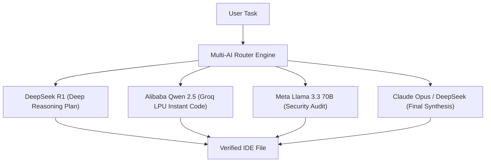

# 🤖 AgentCouncil Extension (VS Code / Antigravity IDE)

> **Architected by Sohel Ahammad**  
> Coordinate DeepSeek R1, Alibaba Qwen 2.5 Coder, Meta Llama 3.3, Google Gemma 2 & Claude Opus simultaneously inside your IDE!

---

## 🌟 What This Extension Does

Instead of relying on just 1 AI model, this extension automatically distributes coding tasks across specialized AI models:



---

## 📦 How to Install in 1 Click:

### Method 1: Load Directly in VS Code / Antigravity
1. Copy the `extensions/agent-council` folder into:
   - **Windows:** `%USERPROFILE%\.vscode\extensions\`
   - **Antigravity IDE:** `~/.gemini/antigravity-ide/extensions/`
2. Restart your IDE or press `Ctrl+Shift+P` -> **Developer: Reload Window**.

### Method 2: Package as `.vsix`
```bash
cd extensions/agent-council
npx vsce package
```
Then right-click the generated `.vsix` file and select **"Install from VSIX..."**!

---

## ⚙️ Configuration / API Keys
Open **Settings** (`Ctrl+,`) and search for `Multi-AI`:
* `multiAI.groqApiKey`: Your Groq API key (`gsk_...`)
* `multiAI.openRouterApiKey`: Your OpenRouter key (`sk-or-v1-...`)
* `multiAI.agentRouterApiKey`: Your AgentRouter key (`sk-...`)

---

## 🚀 Built-in Commands:
* `Ctrl+Shift+P` -> **Multi-AI: Orchestrate Coding Task (All Agents)**
* `Ctrl+Shift+P` -> **Multi-AI: Multi-Model Security & Code Review**
* `Ctrl+Shift+P` -> **Multi-AI: Check Router Health & Providers**
* Open Activity Bar -> **Multi-AI Autonomous Council** for real-time multi-model chat!
